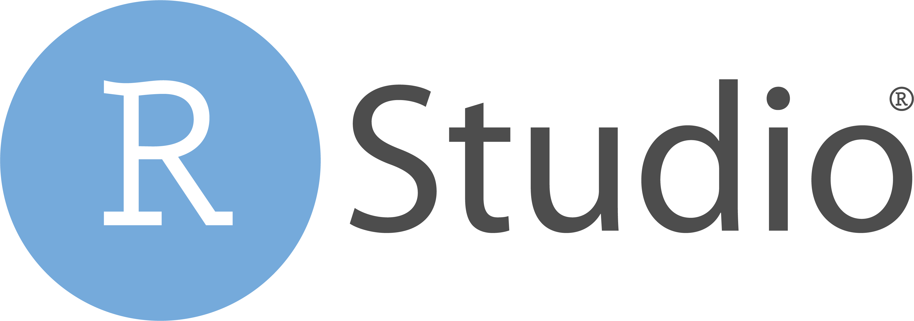

layout: true
  
<div class="my-footer"><span>

<a href="https://twitter.com/RLadiesSaoPaulo">Twitter</a> | 
<a href="http://instagram.com/RLadiesSaoPaulo">Instagram</a> |
<a href="http://facebook.com/RLadiesSaoPaulo">Facebook</a> |
<a href="https://www.meetup.com/pt-BR/R-Ladies-Sao-Paulo">Meetup</a> |
<a href="https://github.com/rladies/meetup-presentations_sao-paulo">Github</a> |
<a href="http://bit.ly/1anoR-LadiesSP">bit.ly/1anoR-LadiesSP</a> 


</span></div> 

---
class: middle

```{r setup, include=FALSE}
knitr::opts_chunk$set(echo = FALSE, fig.align = "center", message=FALSE, warning=FALSE)
```

# Programação

### 1) Networking

### 2) Apresentação das atividades das RLadies

### 3) Fishbowl + Roda de conversa com o tema: "Como o R-Ladies é e pode ser uma porta de entrada/emponderamento para o mundo da tecnologia?"

### 4) Encerramento (com sorteio)
---
class:  center, middle
# O que é o R-Ladies?

R-Ladies é uma organização mundial que promove a diversidade de gênero na comunidade da linguagem R.
R-Ladies São Paulo integra, orgulhosamente, a organização R-Ladies Global, em São Paulo.

## Como?

Através de meetups e mentorias em um ambiente seguro e amigável.

Nosso principal objetivo é promover a linguagem computacional estatística R compartilhando conhecimento, assim, quem tiver interesse na linguagem será bem-vinda, independente do nível de conhecimento. 


Fonte: [About us - R-Ladies](https://rladies.org/about-us/), [Meetup R-Ladies São Paulo](https://www.meetup.com/R-Ladies-Sao-Paulo/)


---
class:   center, middle
## Para quem?

Nosso principal público-alvo são as pessoas que se identificam com o gênero feminino, portanto, mulheres cis, mulheres trans, bem como pessoas não-binárias e queer.

## Missão

Como uma iniciativa de diversidade, a missão das R-Ladies é alcançar uma representação proporcional de pessoas de gêneros atualmente sub-representados na comunidade R, incentivando, inspirando e caacitando-as.


Fonte: [About us - R-Ladies](https://rladies.org/about-us/), [Meetup R-Ladies São Paulo](https://www.meetup.com/R-Ladies-Sao-Paulo/)

---
class:   center, middle
## Como o R-Ladies começou?
```{r echo=FALSE, fig.align='center', out.width="20%"}
knitr::include_graphics("https://raw.githubusercontent.com/beatrizmilz/IV-SER-RLadies/master/docs/img/gabriela.jpeg")
```


**[Gabriela de Queiroz](https://github.com/gdequeiroz)** fundou o R-Ladies no dia **1 de outubro de 2012**. Ela queria retribuir à comunidade depois de ir a vários encontros e aprender muito de graça. O primeiro encontro R-Ladies foi realizado em ** San Francisco, Califórnia (Estados Unidos) **. Nos anos seguintes, mais capítulos do R-Ladies começaram em todo o mundo.
Fonte: [About us - R-Ladies](https://rladies.org/about-us/history/)

---
class:center, middle
```{r echo=FALSE, out.width="100%"}

```
Fonte: [R-Ladies Shiny App](https://gqueiroz.shinyapps.io/rshinylady/)  (10/08/2019)
---
class:   center, middle
## Código de conduta
O R-Ladies dedica-se a proporcionar uma experiência livre de assédio para todas as pessoas partcicipantes, desta forma, não é tolerada nenhuma forma de assédio.
[Código de conduta - R-Ladies](https://github.com/rladies/starter-kit/wiki/Code-of-Conduct#portuguese)
---
class:   center, middle
## R-Ladies no Brasil
```{r include=FALSE}
rladies_br <- data.frame(
  city = c(
    "Goiania",
    "Lavras",
    "Florianópolis",
    "Salvador",
    "Niterói",
    "Curitiba",
    "Belo Horizonte",
    "São Paulo",
    "Porto Alegre",
    "Natal",
    "Americana",
    "Rio de Janeiro"
  ),
  dt_created = c(
    "2019-05-06",
    "2019-04-16",
    "2019-04-07",
    "2018-07-23",
    "2018-06-04",
    "2018-05-29",
    "2018-04-20",
    "2018-02-10",
    "2017-10-30",
    "2017-09-25",
    "2017-06-24",
    "2017-02-27"
  ),
  members = c(18, 33, 205, 146, 375, 174, 629,
              456, 270, 137, 37, 410)
)
```
Atualizado em: 10/08/2019. Fonte: [R-Ladies Shiny App](https://gqueiroz.shinyapps.io/rshinylady/) 
```{r echo=FALSE}
library(tidyverse)
rladies_br %>% dplyr::arrange(desc(members)) %>%  
DT::datatable(autoHideNavigation = TRUE, options = list(
  pageLength = 6
   ))
```
---
class:  center, middle
## Como saber mais?

  - Website RLadies Global: [https://rladies.org/](https://rladies.org/)

  - Twitter: [@RLadiesGlobal](https://twitter.com/rladiesglobal), [@RLadiesSaoPaulo](https://twitter.com/RLadiesSaoPaulo)

  - Instagram: [@RLadiesSaoPaulo](http://instagram.com/RLadiesSaoPaulo)

  - Facebook: [@RLadiesSaoPaulo](http://facebook.com/RLadiesSaoPaulo)

  - MeetUp: [https://www.meetup.com/pt-BR/R-Ladies-Sao-Paulo](https://www.meetup.com/pt-BR/R-Ladies-Sao-Paulo)

  - Github: [https://github.com/rladies/meetup-presentations_sao-paulo](https://github.com/rladies/meetup-presentations_sao-paulo)

  - R-Ladies LATAM Blog (Latin America) - Em breve!


### Não tem capítulo na sua cidade e quer iniciar um?
<center> Saiba como em <a href="https://rladies.org/about-us/help/"> R-Ladies - How do get involved </a> </center>

---
class:  center
# Apoio
<BR>
```{r, out.width="15%", fig.cap="<center><b>RConsortium</center></b>"}
knitr::include_graphics("img/logos/RCONSORTIUM.png")
```
<BR>
```{r, out.width="35%", fig.cap="<center><b>ThoughtWorks</center></b>"}
knitr::include_graphics("img/logos/thoughtworks.jpg")
```
<BR>

```{r, out.width="30%", fig.cap="<center><b>CONRE-3</center></b>"}

```


---
class:  center

<iframe src='https://cdn.knightlab.com/libs/timeline3/latest/embed/index.html?source=1zD0Ou45qpqvO1O-vOOVAqidXETxKgLKVR-kQCMzIm_0&font=Fjalla-Average&lang=pt-br&initial_zoom=2&height=625' width='100%' height='625' webkitallowfullscreen mozallowfullscreen allowfullscreen frameborder='0'></iframe>

---
class:  center, middle, inverse

# Agradecimentos!

---
class:  center, middle

# Agradecemos os apoios! <3
## Co-organizadoras - Capítulo São Paulo

  - [Haydée Svab](https://www.linkedin.com/in/hsvab/)

  - [Alissa Munerato](https://br.linkedin.com/in/alissa-munerato-1b0501103)

  - [Bruna Wundervald](http://brunaw.com/)

  - [Beatriz Milz](https://beatrizmilz.com)

  - [Bruna Garbes](https://github.com/brunagarbes)

  - [Nathália Demetrio](https://github.com/natydemi)


---
class:  center, middle
# Agradecemos os apoios! <3

## Espaços para Meetup:
- ThoughtWorks SP
- NCC/IFT - UNESP Barra Funda
- USP
- MobiLab
- Loggi
- CONRE-3
- FIAP
- PUC-SP
- SPC Brasil
- COLAB.RE
- Curso-R

---
class:  center, middle
# Agradecemos os apoios! <3

## Coffe break:
- ThoughtWorks SP
- Loggi
- SPC Brasil
- COLAB.RE
---
class:  center, middle
# Agradecemos os apoios! <3

## Bolsas em cursos de R:


```{r, out.width="30%", fig.cap="<center><b><a href='https://www.curso-r.com/'>Curso-R</a></center></b>"}
  
```

Cerca de **vinte bolsas** em diversos cursos:

- Workshop: Conheça o R

- Introdução à programação em R

- Dashboards com R

- Web scraping em R

- Introdução ao Machine Learning com R

---
class:  center, middle
# Agradecemos os apoios! <3

## Brindes: 


```{r, out.width="30%", fig.cap="<center><b>CONRE-3</center></b>"}

```


```{r, out.width="30%", fig.cap="<center><b>RStudio</center></b>"}

```
---
class:  center, middle
# Agradecemos os apoios! <3
## Apoio financeiro: 


```{r, out.width="15%", fig.cap="<center><b>RConsortium</center></b>"}
knitr::include_graphics("img/logos/RCONSORTIUM.png")
```

---
class: middle
# Como ajudar? <3

- Lecionar workshops de temas básicos

- Lecionar workshops de temas intermediários/avançados

- Palestrar

- Apresentar light talks/apresentações curtas

- Ser monitora nos workshops

- Ajudar na logistica/organização dos eventos (lugares, patrocínio, lista de presença, etc)

- Ajudar na expansão/comunicação/marketing das R-Ladies

- Entre outros :)


## **Acesse o formulário: [bit.ly/participe-RLadies](http://bit.ly/participe-RLadies)**

---
class:  center
# Atividades externas - IV SER

- Local: Niterói, Rio de Janeiro

- **Participação R-Ladies São Paulo**

   - **Apresentação do Pôster**: 
      - Ensino de R através da Comunidade R-Ladies - Capítulo São Paulo - Beatriz Milz, Bruna Garbes, Bruna Wundervald, Haydee Svab
   - **Mini-cursos**:
      - Comunicando seus resultados: Criando apresentações com R - Beatriz e Haydee
      - Análise de Dados Musicais no R - Bruna Wundervald e Julio Trecenti
    - **Palestra**:
      - Probabilistic Graphical Models in R and Python - Bruna Wundervald
      
---
class:  middle
# Atividades externas - IV SER

- **Aprendizado**:
  - Curso de introdução ao Shiny - Dean Atalli

- **Integração com as comunidades**:
  - R-Ladies de outros estados brasileiros
  - R Brasil


```{r echo=FALSE, fig.align='center', out.width="80%"}
knitr::include_graphics("https://secure.meetupstatic.com/photos/event/a/6/2/3/highres_481602531.jpeg")
```

---
class:  middle
# Atividades externas - useR!2019

- Local: Toulouse, França

- Bolsas de diversidade/Diversity Scholarships: Angélica Custódio e Beatriz Milz

- Tidy Dev Day: [post no blog da Curso-R](https://www.curso-r.com/blog/2019-08-12-tidydevday)

- Lightning Talk:  
  - Painel: Open science, Education & Community. 
  - Apresentado por Beatriz Milz e co-autoria com Bruna Wundervald.
  - Conteúdo: The evolution and importance of the R-Ladies São Paulo chapter in Brazil 

- Post sobre o evento em geral: em breve!
---
class:  middle
# Atividades externas - useR!2019

```{r echo=FALSE, fig.align='center', out.width="100%"}
knitr::include_graphics("https://d33wubrfki0l68.cloudfront.net/0ea959847b8b0c4ac5cd6df4104d02bd22b7da53/b2d02/img/blog/user2019/brasileiros.jpg")
```

---
class:  middle
# Ao final do dia teremos um sorteio!
```{r echo=TRUE}
library(readr)

participantes <- read_csv("participantes.csv")

#sample(participantes$Participantes, 1)
```


---
class: middle
```{r echo=FALSE, fig.align='center', out.width="80%"}
knitr::include_graphics("img/alissonhorst.jpg")
```
